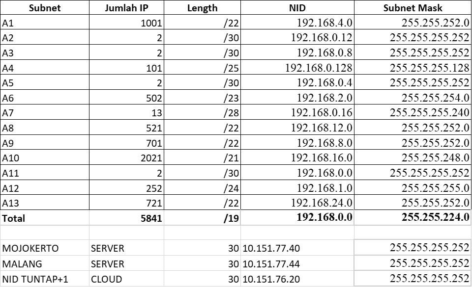

# Jarkom_Modul4_Lapres_C04

### Anggota Kelompok C04 :
#### 05111840000029 - Khofifah Nurlaela
#### 05111840000053 - Yulia Niza
 

##### Tabel 1. Subnetting

## 1. Cisco Packet Tracer dengan Metode VLSM

### Persiapan
#### Langkah 1 
Mentukan jumlah subnet yang ada di dalam topologi

Lalu menentukan jumlah alamat IP yang dibutuhkan oleh tiap subnet dan melakukan labelling netmask berdasarkan jumlah IP yang dibutuhkan dengan melihat pada tabel subnet.
##### Tabel 2. Pembagian IP

Berdasarkan total IP dan netmask yang dibutuhkan, maka kita dapat menggunakan netmask /19 untuk memberikan pengalamatan IP pada subnet.

#### Langkah 2
Subnet besar yang dibentuk memiliki NID 192.168.0.0 dengan netmask /19. Lalu Hitung pembagian IP berdasarkan NID dan netmask tersebut menggunakan pohon seperti gambar di bawah dan lakukan subnetting dengan menggunakan pohon tersebut untuk pembagian IP sesuai dengan kebutuhan masing-masing subnet yang ada.

Dari pohon dari pohon tersebut akan diperoleh pembagian IP sesuai pada **Tabel 2. Pembagian IP** diatas

### Praktik
#### Membuat Topologi

#### Subnetting

Mengatur IP untuk masing-masing interface yang ada di setiap device sesuai dengan pembagian subnet pada pohon VLSM diatas tadi
Interface dapat diatur pada menu Config > INTERFACE > “nama interface”.

#### Interface Router - Router
Misal pada **subnet A5** SURABAYA yang mengarah ke BATU dengan **eth1/1** lalu isi dengan data sesuai **Tabel 2. Pembagian IP** disini kita menggunakan NID+1 yaitu 192.168.0.5.

dan mengatur IP pada interface BATU yang mengarah ke SURABAYA, disini kita menggunakan NID+2 yakni 192.168.0.6

#### Interface Router - Client
Misal **subnet A8** Mengatur IP pada interface BATU yang mengarah ke client NGANJUK yakni 192.168.12.1

dan mengatur IP pada interfaces client NGANJUK yakni 192.168.12.2 dan IP Gateway yang mengarah ke BATU yakni 192.168.12.1

#### Interface Router - Server, 
konfigurasinya sama seperti Router - Client tetapi menggunakan IP DMZ masing-masing kelompok dan dibagi 2 karena server berada pada subnet yang berbeda.
IP DMZ kelompok kami adalah 10.151.77.40 sehingga untuk server MOJOKERTO dihasilkan IP dengan range antara 10.151.77.40-10.151.77.43 dan server MALANG 10.151.77.44-10.151.77.47.
Misal untuk interface SURABAYA yang mengarah ke MOJOKERTO, maka digunakan IP 10.151.77.41

dan pada interface MOJOKERTO digunakan IP 10.151.77.42 dengan IP Gateway yang mengarah ke SURABAYA yakni 10.151.77.41

Setelah melakukan konfigurasi alamat IP pada setiap interfaces, maka langkah selanjutnya adalah routing

 

#### Routing

## 2. UML dengan Metode CIDR
