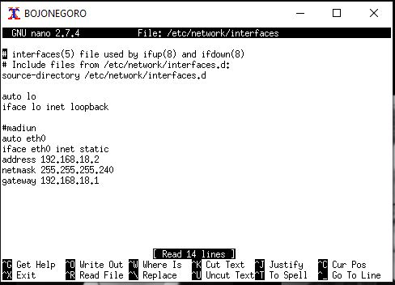
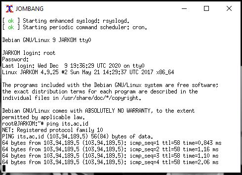

# Jarkom_Modul4_Lapres_C04

### Anggota Kelompok C04 :
#### 05111840000029 - Khofifah Nurlaela
#### 05111840000053 - Yulia Niza
<br>

##### Tabel 1. Subnetting


## 1. Cisco Packet Tracer dengan Metode VLSM

### Persiapan
#### Langkah 1 
Mentukan jumlah subnet yang ada di dalam topologi


Lalu menentukan jumlah alamat IP yang dibutuhkan oleh tiap subnet dan melakukan labelling netmask berdasarkan jumlah IP yang dibutuhkan dengan melihat pada [Tabel 1](#tabel-1-subnetting).
##### Tabel 2. Pembagian IP


Berdasarkan total IP dan netmask yang dibutuhkan, maka kita dapat menggunakan netmask /19 untuk memberikan pengalamatan IP pada subnet.

#### Langkah 2
Subnet besar yang dibentuk memiliki NID 192.168.0.0 dengan netmask /19. Lalu Hitung pembagian IP berdasarkan NID dan netmask tersebut menggunakan pohon seperti gambar di bawah dan lakukan subnetting dengan menggunakan pohon tersebut untuk pembagian IP sesuai dengan kebutuhan masing-masing subnet yang ada.


Dari pohon dari pohon tersebut akan diperoleh pembagian IP sesuai pada [Tabel 2](#tabel-2-pembagian-ip) diatas


### Praktik
#### 1. Membuat Topologi


#### 2. Subnetting

Mengatur IP untuk masing-masing interface yang ada di setiap device sesuai dengan pembagian subnet pada pohon VLSM diatas tadi
Interface dapat diatur pada menu Config > INTERFACE > “nama interface”.

#### Interface Router - Router
Misal pada **subnet A5** SURABAYA yang mengarah ke BATU dengan **eth1/1** lalu isi dengan data sesuai [Tabel 2](#tabel-2-pembagian-ip) disini kita menggunakan NID+1 yaitu 192.168.0.5.


dan mengatur IP pada interface BATU yang mengarah ke SURABAYA, disini kita menggunakan NID+2 yakni 192.168.0.6


#### Interface Router - Client
Misal **subnet A8** Mengatur IP pada interface BATU yang mengarah ke client NGANJUK yakni 192.168.12.1


dan mengatur IP pada interfaces client NGANJUK yakni 192.168.12.2 dan IP Gateway yang mengarah ke BATU yakni 192.168.12.1


#### Interface Router - Server
Konfigurasinya sama seperti Router - Client tetapi menggunakan IP DMZ masing-masing kelompok dan dibagi 2 karena server berada pada subnet yang berbeda.
IP DMZ kelompok kami adalah 10.151.77.40 sehingga untuk server MOJOKERTO dihasilkan IP dengan range antara 10.151.77.40-10.151.77.43 dan server MALANG 10.151.77.44-10.151.77.47.
Misal untuk interface SURABAYA yang mengarah ke MOJOKERTO, maka digunakan IP 10.151.77.41


dan pada interface MOJOKERTO digunakan IP 10.151.77.42 dengan IP Gateway yang mengarah ke SURABAYA yakni 10.151.77.41


Setelah melakukan konfigurasi alamat IP pada setiap interfaces, maka langkah selanjutnya adalah routing

<br>

#### 3. Routing
##### Tabel 3. Routing


- Routing dapat dilakukan pada menu Config > Routing > Static pada device Router.

- Routing dilakukan dengan menambahkan NID, Netmask, dan Gateway dari router lain yang tidak terhubung langsung dengan Router tersebut

- SURABAYA merupakan router utama karena terhubung langsung dengan internet, untuk itu router yang berada dibawahnya perlu ditambahkan default routing agar router dapat mengirimkan paket sesuai dengan tujuan. 

- Misal pada router PASURUAN
Subnet terdekatnya adalah A2, A3, dan A9 untuk itu dia perlu dikenalkan dengan subnet lain, yaitu A4, A10, dan subnet yang terhubung dengan router utama(SURABAYA).

Sehingga kita hanya perlu menambahkan routing pada A4, A10 dan Default Routing


- Melakukan routing pada setiap router sesuai data pada [Tabel 3](#tabel-3-routing) diatas

#### 4. Testing

Testing dilakukan dengan cara ping dari client ke IP tujuan atau menggunakan tombol dengan ikon surat pada toolbar.

Berikut adalah beberapa contoh hasil testing :


## 2. UML dengan Metode CIDR
#### 1. Perhitungan Subnet dengan Metode CIDR
**Langkah 1:**  Tentukan subnet yang ada dalam topologi dan lakukan labelling netmask terhadap masing-masing subnet. 


**Langkah 2:**  Gabungkan subnet paling bawah di dalam topologi. Paling bawah berarti subnet yang paling jauh dari internet (gambar awan). Maka pada topologi yang digunakan kali ini, subnet yang dapat digabungkan adalah **A4** dengan **A5**, **A8** dengan **A9**, dan subnet **A12** dengan **A8**. Subnet yang digabung tersebut akan membentuk sebuah subnet lebih besar dari subnet-subnet kecil yang ada di dalamnya.


Subnet **B1** merupakan hasil penggabungan dari subnet **A4** dan **A5** memiliki netmask **/20**, Subnet **B2** merupakan hasil penggabungan dari subnet **A8** dan **A9** memiliki netmask **/22**, dan Subnet **B3** merupakan hasil penggabungan dari subnet **A12** dan **A13** memiliki netmask **/21**.

Lalu ulangi langkah tersebut sampai menjadi sebuah subnet besar yang mencakup 1 topologi yang kita miliki.


Subnet **C1** merupakan hasil penggabungan dari subnet **B1** dan **A3** memiliki netmask **/19**, Subnet **C2** merupakan hasil penggabungan dari subnet **B2** dan **A10** memiliki netmask **/21**, dan Subnet **C3** merupakan hasil penggabungan dari subnet **B3** dan **A11** memiliki netmask **/20**.


Subnet **D1** merupakan hasil penggabungan dari subnet **C1** dan **A6** memiliki netmask **/18** dan Subnet **D2** merupakan hasil penggabungan dari subnet **C1** dan **C2** memiliki netmask **/19**.


Subnet **E1** merupakan hasil penggabungan dari subnet **D1** dan **A2** memiliki netmask **/17** dan Subnet **E2** merupakan hasil penggabungan dari subnet **D1** dan **A7** memiliki netmask **/18**.


Subnet **F1** merupakan hasil penggabungan dari subnet **E2** dan **A1** memiliki netmask **/17**.


Subnet **G1** merupakan hasil penggabungan dari subnet **F1** dan **E1** memiliki netmask **/16**.

**Langkah 3:**  Dari proses penggabungan yang telah dilakukan, didapatkan sebuah subnet besar dengan netmask /16. Kali ini dapat menggunakan NID 192.168.0.0, netmask 255.255.0.0.

**Langkah 4:**  Hitung pembagian IP dengan pohon berdasarkan penggabungan subnet yang telah dilakukan.


**Langkah 5:**  Berdasarkan penghitungan, maka didapatkan pembagian IP sebagai berikut.


#### 2. Membuat topologi
Untuk topologi sesuai yang ada pada gambar, maka sintaks untuk file **topologi.sh** adalah sebagai berikut:
```
# Switch
uml_switch -unix switch1 > /dev/null < /dev/null &
uml_switch -unix switch2 > /dev/null < /dev/null &
uml_switch -unix switch3 > /dev/null < /dev/null &
uml_switch -unix switch4 > /dev/null < /dev/null &
uml_switch -unix switch5 > /dev/null < /dev/null &
uml_switch -unix switch13 > /dev/null < /dev/null &
uml_switch -unix switch15 > /dev/null < /dev/null &
uml_switch -unix switch16 > /dev/null < /dev/null &
uml_switch -unix switch17 > /dev/null < /dev/null &
uml_switch -unix switch18 > /dev/null < /dev/null &
uml_switch -unix switch19 > /dev/null < /dev/null &
uml_switch -unix switch20 > /dev/null < /dev/null &
uml_switch -unix switch21 > /dev/null < /dev/null &
uml_switch -unix switch22 > /dev/null < /dev/null &
uml_switch -unix switch25 > /dev/null < /dev/null &

# Router
xterm -T SURABAYA -e linux ubd0=SURABAYA,jarkom umid=SURABAYA eth0=tuntap,,,10.151.76.21 eth1=daemon,,,switch1 eth2=daemon,,,switch2 eth3=daemon,,,switch3 eth4=daemon,,,switch13 mem=64M &
xterm -T PASURUAN -e linux ubd0=PASURUAN,jarkom umid=PASURUAN eth0=daemon,,,switch2 eth1=daemon,,,switch4 eth2=daemon,,,switch19 mem=64M &
xterm -T PROBOLINGGO -e linux ubd0=PROBOLINGGO,jarkom umid=PROBOLINGGO eth0=daemon,,,switch4 eth1=daemon,,,switch15 eth2=daemon,,,switch16 mem=64M &
xterm -T BATU -e linux ubd0=BATU,jarkom umid=BATU eth0=daemon,,,switch3 eth1=daemon,,,switch5 eth2=daemon,,,switch21 eth3=daemon,,,switch22 mem=64M &
xterm -T MADIUN -e linux ubd0=MADIUN,jarkom umid=MADIUN eth0=daemon,,,switch22 eth1=daemon,,,switch25 mem=64M &
xterm -T KEDIRI -e linux ubd0=KEDIRI,jarkom umid=KEDIRI eth0=daemon,,,switch5 eth1=daemon,,,switch17 eth2=daemon,,,switch18 mem=64M &
xterm -T BLITAR -e linux ubd0=BLITAR,jarkom umid=BLITAR eth0=daemon,,,switch17 eth1=daemon,,,switch20 mem=64M &

# Server
xterm -T MALANG -e linux ubd0=MALANG,jarkom umid=MALANG eth0=daemon,,,switch18 mem= 64M &
xterm -T MOJOKERTO -e linux ubd0=MOJOKERTO,jarkom umid=MOJOKERTO eth0=daemon,,,switch13 mem=64M &

# Klien
xterm -T SAMPANG -e linux ubd0=SAMPANG,jarkom umid=SAMPANG eth0=daemon,,,switch1 mem=64M &
xterm -T SIDOARJO -e linux ubd0=SIDOARJO,jarkom umid=SIDOARJO eth0=daemon,,,switch19 mem=64M &
xterm -T BANYUWANGI -e linux ubd0=BANYUWANGI,jarkom umid=BANYUWANGI eth0=daemon,,,switch16 mem=64M &
xterm -T JEMBER -e linux ubd0=JEMBER,jarkom umid=JEMBER eth0=daemon,,,switch16 mem=64M &
xterm -T BONDOWOSO -e linux ubd0=BONDOWOSO,jarkom umid=BONDOWOSO eth0=daemon,,,switch15 mem=64M &
xterm -T JOMBANG -e linux ubd0=JOMBANG,jarkom umid=JOMBANG eth0=daemon,,,switch22 mem=64M &
xterm -T BOJONEGORO -e linux ubd0=BOJONEGORO,jarkom umid=BOJONEGORO eth0=daemon,,,switch25 mem=64M &
xterm -T NGANJUK -e linux ubd0=NGANJUK,jarkom umid=NGANJUK eth0=daemon,,,switch21 mem=64M &
xterm -T LUMAJANG -e linux ubd0=LUMAJANG,jarkom umid=LUMAJANG eth0=daemon,,,switch17 mem=64M &
xterm -T TULUNGAGUNG -e linux ubd0=TULUNGAGUNG,jarkom umid=TULUNGAGUNG eth0=daemon,,,switch20 mem=64M &
```


#### 3. Mengatur IP untuk masing-masing interface yang ada di setiap device sesuai dengan pembagian subnet pada pohon CIDR.

- Pembagian IP masing-masing UML ada pada tabel berikut:


- Buka `/etc/network/interfaces` untuk mengatur interface pada setiap UML.

 
 

 
 

 
 

 
 

 


- Pada UML Surabaya, jangan lupa menjalankan iptables.

#### 4. Routing
- Pada setiap router jangan lupa melakukan setting sysctl , dengan mengetikkan perintah `nano /etc/sysctl.conf`.
- Hilangkan tanda pagar (#) pada bagian `net.ipv4.ip_forward=1`. Kemudian ketikkan `sysctl -p` untuk mengaktifkan perubahan yang ada.
- Routing dilakukan pada setiap device router dengan membuat file **route.sh**, syntax :

**SURABAYA**
``` 
route add -net 192.168.128.0 netmask 255.255.192.0 gw 192.168.192.2
route add -net 192.168.0.0 netmask 255.255.224.0 gw 192.168.32.2
route add -net 10.151.77.44 netmask 255.255.255.252 gw 192.168.32.2
```


**PASURUAN**
```
route add -net 192.168.128.0 netmask 255.255.240.0 gw 192.168.144.2
```


**BATU**
```
route add -net 192.168.0.0 netmask 255.255.248.0 gw 192.168.8.2
route add -net 10.151.77.44 netmask 255.255.255.252 gw 192.168.8.2
route add -net 192.168.18.0 netmask 255.255.255.240 gw 192.168.16.3
```


**KEDIRI**
```
route add -net 192.168.0.0 netmask 255.255.248.0 gw 192.168.4.3
```


- Aktifkan route dengan menjalankan `source route.sh`.
- Lalu lihat hasil routing dengan perintah :
``` route -n ```

#### 5. Testing
Untuk mengetesnya dapat dilakukan dengan cara `ping its.ac.id` pada setiap UML.

 
 

 
 

 
 

 
 

 
